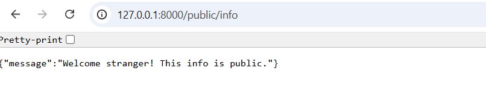
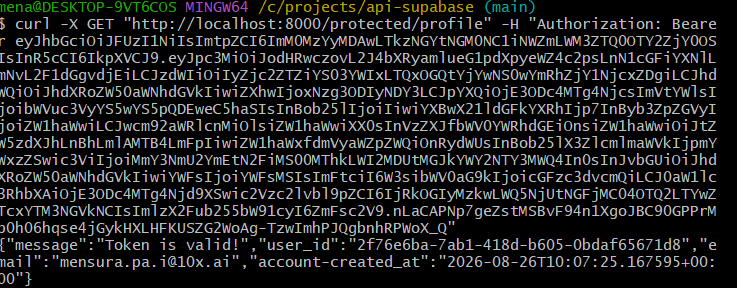
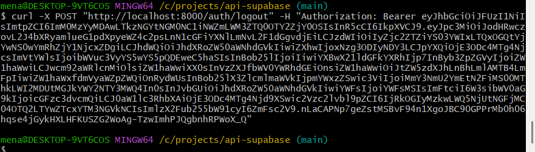
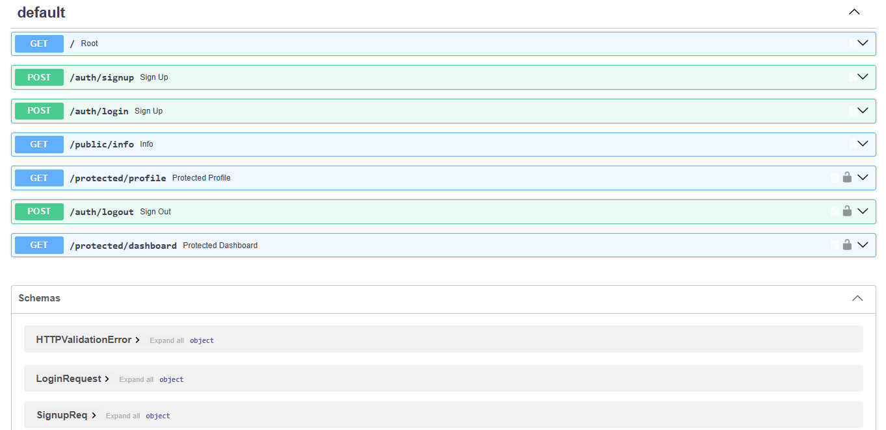
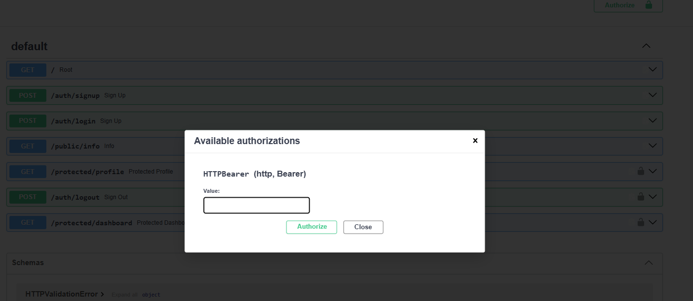

# API with Supabase

 API built with **Python and Supabase **

The API implementation for Supabase project.

## Requirements

- Python 3.x
- FastAPI
- Uvicorn
- Supabase

## Installation & Running

Clone the repository and navigate into the project:

```bash
cd /c/projects/api-supabase
```

Install FastAPI:

```bash
python -m pip install "fastapi[standard]"
```

Start the server:

```bash
python -m fastapi dev main.py
```

The API will be available at:

```text
http://localhost:8000
```

Interactive Swagger documentation is available at:

```text
http://localhost:8000/docs
```

Create Supabase account and copy

```text
SUPABASE_URL
SUPABASE_KEY
```

## API Endpoints

| Method | Endpoint | Description | Success |
|---|---|---|---|
| GET | `/auth/signup` | Signs up user in Supabase | 201 |
| GET | `/auth/login` | Logs user into Supabase account | 200 |
| GET | `/public/info` | Public endpoint example | 200 |
| POST | `/protected/profile` | Protected endpoint for authenticated user | 201 |
| PUT | `/auth/logout` | Log out user | 204 |


## API Examples

### GET `/auth/signup`

Signs up user in Supabase

```bash
curl -i http://localhost:8000/auth/signup
```

Expected response:

```text
HTTP/1.1 201 OK
```


### GET `/auth/login`

Log in user in Supabase

```bash
curl -i http://localhost:8000/auth/login
```

Expected response:

```text
HTTP/1.1 200 OK
```


### GET `/public/info`

Exposes public endpoint accessible by anyone

```bash
curl -i http://localhost:8000/public/info
```

Expected response:

```text
HTTP/1.1 200 OK
```



### GET `protected/profile`

Exposes public endpoint accessible by anyone

```bash
curl -i http://localhost:8000/protected/profile
```

Expected response:

```text
HTTP/1.1 200 OK
```
Not authenticated user


Authenticated user



### GET `auth/logout`

Exposes public endpoint accessible by anyone

```bash
curl -i http://localhost:8000/auth/logout
```

Expected response:

```text
HTTP/1.1 204 OK
```
Log out user



Authenticated user


## Swagger UI

FastAPI automatically generates interactive API documentation using OpenAPI.

Open:

```text
http://localhost:8000/docs
```

Swagger UI can be used to test the complete CRUD workflow without using `curl`.

### Swagger Screenshot



### Swagger padlock

 Authorize padlock
